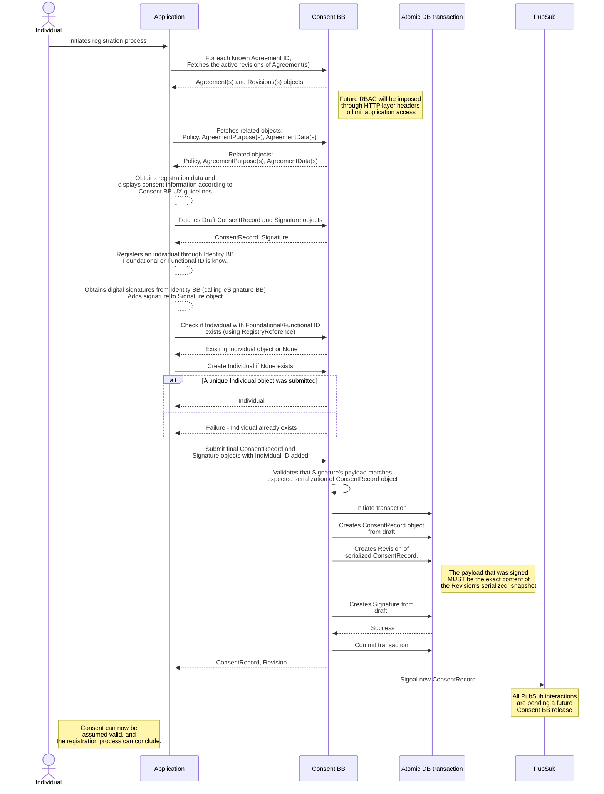
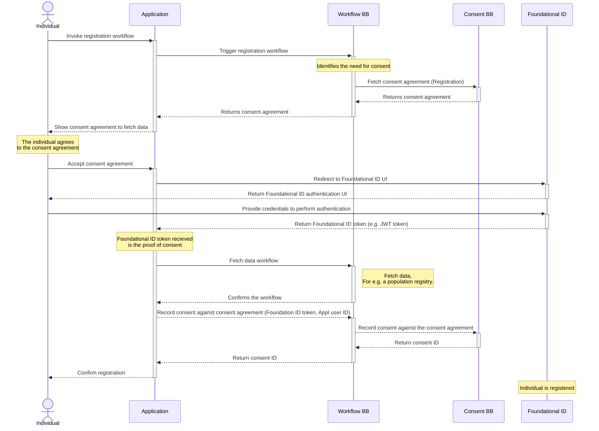
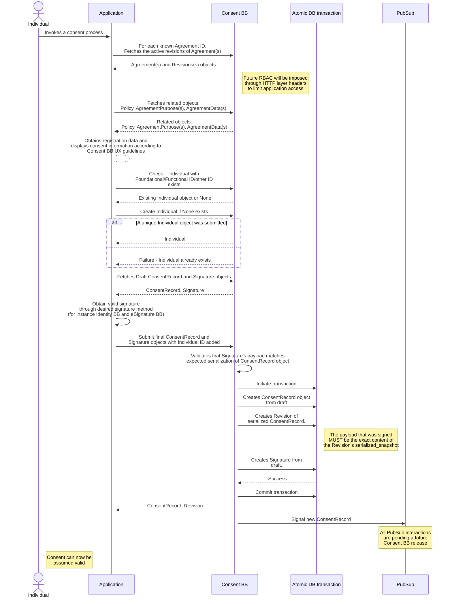
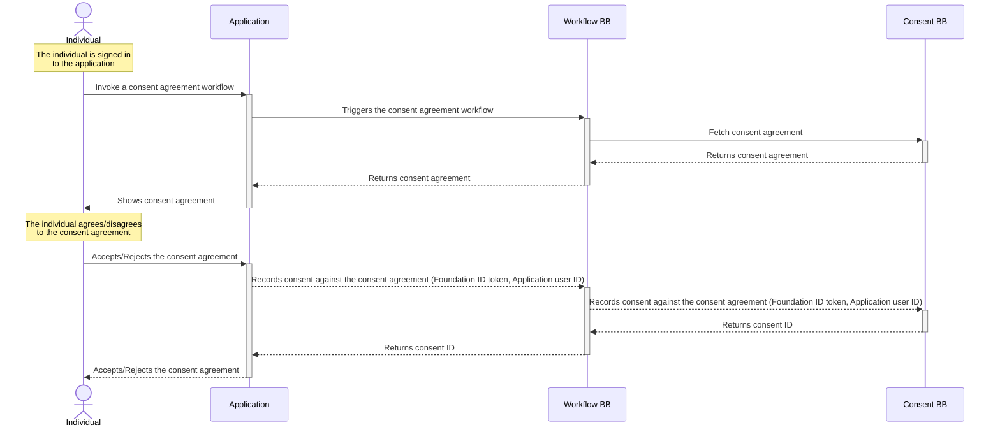
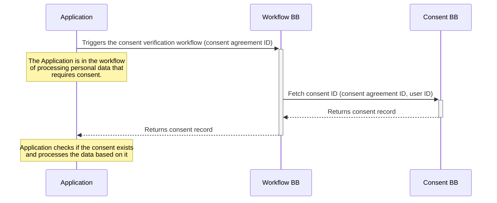

# 9 Internal Workflows

This section lists workflows that this Building Block must support. Other workflows may be implemented in addition to those listed.

## 9.1 About universal workflows

The Workflow Building Block triggers the need for consent as part of the general business flow. The assumption is that a consenting process never exists outside of a purposeful comprehensive business process. Hence, it is important to define and control the data processing activities as part of a holistic data service.

This section lays out key universal consent workflows that can be re-used within the various use cases ([see Workflow Building Block](https://govstack.gitbook.io/bb-workflow/v/workflow-1.0/)). This enforces the best practices for organisations to adhere to personal data processing standards in any given context and jurisdiction. In these sequences, we have removed the Digital Registries Building Block in the sequence for simplicity. It will store all persistent consent data.

## 9.2 Universal workflow: Recording consent at initial registration (pre-registration)

The first and somewhat unique use case is related to the need for consent when the Individual is not yet provisioned in the System processing the data. In such cases, the workflow requires the creation of a valid and trusted Foundational ID to be linked with the Consent Record. Below is shown how a pre-registration use of Consent's Workflow works.

### 9.2.1 Internal workflow

* At the very beginning, the registration process will know which `Agreement` IDs are eligible for registration and fetch the `Agreement`(s) and their related objects, such as `AgreementPurpose`, `AgreementData`, `Controller` and `Policy`.
* The signing process is initiated by calling the API endpoint `/service/individual/record/consentrecord/draft/` which produces two resulting instances: `ConsentRecord`, `Signature`. None of these are stored in the database, so they have no `id` value supplied. They will be used after the registration process is completed.
* Once the registration is completed, and a functional or foundational ID (which ever is desired to use, the Consent BB uses the notion of "external ID" here) is known by the Identity BB, the registration process should resolve if this ID has previously been used to store consent by a request to `/service/individuals/`. If an `Individual` object does not exist, a call is issued to `/service/individual/` to create the individual in the Consent BB with a reference used by the Identity Building Block.
* At the end of the registration, the API endpoint `/service/individual/record/consentrecord/` is called with the draft `ConsentRecord` and `Signature` objects to be saved.

#### Signing the draft `ConsentRecord`

When a draft is created, the Consent BB should issue a pair of object instances that are not saved in the database. They have the same schema as the real database objects, but the `id` field is left blank.

The Signature object would normally contain the content of a Revision object in its `payload` field. In this case, it will contain the content of a Revision object that was not stored in the database when it was generated, so it doesn't have an ID yet.

We use the two boolean flags `Revision.signed_without_object_id` and `Signature.signed_without_object_reference` to denote that the Revision and Signature objects were hashed and signed without any reference to a database row. However, these fields are filled in later! When Signature and Revision objects are validated by serializing and hashing the data that they claim to represent, we need to note these two flags so we don't generate the wrong hashes or compare serialized values wrongly.

#### **Edge cases**

* `Agreement` and `Policy` objects are revisioned and if the registration process wishes to initiate a different revision from the latest active revision, it should be equipped with the knowledge of the revision IDs.
* In cases where a valid `ConsentRecord` and `Signature` pair already exists in the system, those should be returned instead, and the client-side can understand from the timestamp of the object that it has been created at a previous occasion. This can be resolved by calling `/service/individual/record/agreement/{agreementId}/`.
* If the latest active `Agreement` or `Policy` revisions change, then those changes have to be detected when fetching related objects. The expected `Revision` ID is added to calls that fetch related objects and APIs should fail if there is a mismatch and a different set of related objects are returned compared to the latest active Agreement.
* **CONSENT CAN BE OMITTED BY THE USER**. The Consent BB does not know about this unless informed, since the Application is responsible for the UI. If there is a need to record an opt-out, this is possible to do with the same process, but simply marking the `ConsentRecord` as an explicit opt-out. The Registration process may also skip recording the opt-out and proceed to an alternative path.

#### Sequence diagram

### 9.2.2 Building block interactions

## 9.3 Universal workflow: Recording consent after the registration (post-registration)

In more frequent situations, when the individual is already provisioned in the System (post-registration), the consent workflow uses the existing ID tokens, and only the `ConsentRecord` is to be created.

### 9.3.1 Internal workflow

* As with the [Registration Workflow](9-workflows.md#9.2-universal-workflow-recording-consent-at-initial-registration-pre-registration), the Application needs to know IDs of `Agreement` objects that are eligible for the consent beforehand. It may optionally use a `Revision` ID for an Agreement to specify a specific version of the `Agreement`. Essentially, the application developer should embed these IDs in the process as predefined data.
* In this workflow, the Application has authenticated the individual (user), and if the user consents to the presented Agreement, the `ConsentRecord` will be stored with a relation to an `Individual` entity in the Consent BB. The `Individual` schema has a number of optional fields that will relate it to the original user's identity in a _desired manner_. In other words, the identity of the user is exposed to the Consent BB in a _desired manner_. There are several options:
  * The individual can be managed through a Foundational ID, Functional ID which can be useful for the Consent BB to allow the user to manage all their `ConsentRecord`s at a later stage.
  * A session-related ID that the application or other data consumers can otherwise use at a later stage.
  * An obscurified ID that can be resolved through the Identity BB such that all `ConsentRecord` management can only be performed with a relation to the real individual through authorization of the Identity BB.
* No matter which `Individual` ID is used, the Application is responsible for either fetching an existing or creating a new `Individual` object in the Consent BB.
* The Application is responsible for presenting the UI and calls the necessary endpoints of the Consent BB to store the `ConsentRecord`.
* A draft `ConsentRecord` and `Signature` object is handed to the Application, which it should finalize and submit back.
* There are several options for finalizing the draft `Signature` object: The individual may be requested to explicitly sign the consent through Identity BB and eSignature BB. However, another trusted signing party may also be eligible to record and sign the validity of the ConsentRecord object.

#### Edge cases

* The Application may want to check if consent has already been obtained! This can be done at several stages, if there is a need to guard against parallel processes.
* A `ConsentRecord` may be created at first, but if the signing process fails and no `Signature` object is created, the Application should perform due diligence and delete the `ConsentRecord`.
* Consent can always be omitted during the process or at any later stage. The Application needs to provide an alternative path. This can for instance be handled with the Workflow BB.

#### Sequence diagram

### 9.3.2 Building block interactions

## 9.4: Universal workflow: Consent Verification

In this universal workflow, we check if a valid `ConsentRecord` exists or not for a given data processing event within a business process. This may be the immediate continuation of a consenting workflow by the same System that acquired the `ConsentRecord` or it may be used by a separate business process by a different Application or at a different moment in time. The same verification workflow may be also used for auditing purposes.

### 9.4.1 Internal workflow

* In order to query for the existence of a `ConsentRecord`, the Application needs to know about an `Individual` and an `Agreement`.
* The `Individual` can be resolved through a query using the `RegistryReference` schema as a parameter. The Consent BB will then return matching `Individual` objects.
* As is seen in other workflows, the `Agreement` is resolved by preexisting knowledge of the `Agreement` ID, and the Application may further use a specific `Revision` ID of the Agreement or ask for the latest active `Agreement` by _not_ specifying a `Revision`.
* By using the Individual and `Agreement` IDs, it is possible for the Application to fetch the latest active `ConsentRecord` and `Signature` to resolve the state of consent.
*

### Sequence diagram

TODO

### 9.4.2: Building block interactions

