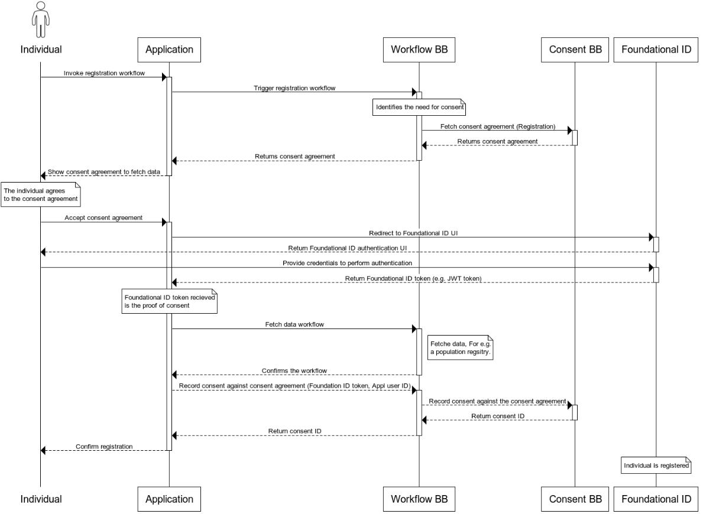

# 9 Workflows

A workflow provides a detailed view of how this building block will interact with other building blocks to support common use cases. This section lists workflows that this building block must support. Other workflows may be implemented in addition to those listed.
## 4.4 Universal Consent Workflows

The workflow BB triggers the need for consent as part of the general business flow. The assumption is that a consenting process never exists outside of a purposeful comprehensive business process. Hence, it is important to define and control the data processing activities as part of a holistic data service. This section lays out key universal consent workflows that can be re-used within the various use-cases (see [explanation in Workflow BB](https://docs.google.com/document/d/1TIQ756eWauQLNeSWUqfm5dpDz_wJsesfZgXBiWXLx9w/edit#bookmark=id.r8eld9zgc5tv)). This enforces the best practices for organisations to adhere to personal data processing standards in any given context and jurisdiction. In these sequences, we have removed the Digital Registries BB in the sequence for simplicity. It will store all persistent consent data.

### 4.4.1	Consenting at initial registration (Pre-registration) using a centralised ID system

The first and somewhat unique use-case is related to the need for consent when the Individual is not yet provisioned in the System processing the data. In such cases, the workflow requires the creation of a valid and trusted Foundational ID to be linked with the Consent Record. Below is shown how a pre-registration use of consent workflow works.

[Diagram Source](https://www.websequencediagrams.com/?lz=dGl0bGUgVW5pdmVyc2FsIGNvbnNlbnQgd29ya2Zsb3cgcHJlLXJlZ2lzdHJhdGlvbiAodXNlcyBjZW50cmFsaXNlZCBJRCkKCmFjdG9yIEluZGl2aWR1YWwKCgACCi0-K0FwcGxpYwA9BTogSW52b2tlIABKDQBpCAoAHwstPitXAIEACEJCOiBUcmlnZ2VyACIXCm5vdGUgb3ZlciAAKQ0KICAgIElkZW50aWZpZXMgdGhlIG5lZWQgZm9yAIFoCAplbmQgbm90ZQoKAGcLLT4rQwCCCQdCQjogRmV0Y2gAghkJYWdyZWVtZW50IChSAIIVCykKACkKLS0-LQCBNA1SZXR1cm5zADISAGkNLT4tAIIiDQAcGgCCIAwtPi0AgnQKOiBTaG93AIEZE3RvIGYAgUIFZGF0YSAAgigMAIMwCyAgICBUaGUgaQCDRQkAgWgGcwCCRgZ0bwCCPwUAgXcSAII7CwCDYxtBY2NlcHQAgS8fPitGb3VuZACEbgVhbCBJRDogUmVkaXJlYwCBPwUADg8gVUkKCgAiDwCCARAAgnYGACkRYXV0aGVudACFFQcgVUkAhSoOAHURUHJvdmlkZSBjcmUAhE4FYWxzIHRvIHBlcmZvcm0AQA8AgQAUAINIEwCBPhF0b2tlbiAoZS5nLiBKV1QACgYpAIMiDQCGRQwKICAALBdyZWNpZXZlZACGAAVpAIV2BnByb29mIG9mAIVpEwCGYRsAhXcGAIQxBQCHIgkAhmwFcmlnaHQgb2YAhmkMAIZuBQCGKgVlAIRkBSwgRm9yIGUuZy4AhwgFYSBwb3B1bACISgZyZWdzaXRyeS4Ahm0XAIV-EENvbmZpcm0Ah0IGAIghFQCIJxBSZWNvcmQAhy4LYWlucwCEbhMgKACEagoAgn0JLACCZQUgdXNlcgCJZAUAhxsOAIgTDQBRFwCGFxUAiAQiAIsCCUlEAId7IwAiDACHexsAgjYHAIpuDQCKLQwAhmQRAItHCiBpcwCLKwdlcmVkCgoKCg&s=default)

### 4.4.2	Consenting after the registration (Post-registration) 

In more frequent situations, when the Individual is already provisioned in the System (post-registration), the consent workflow use the existing ID tokens, and only the Consent Record is to be created. The following diagram shows how a generic post-registration use of consent works: 

[Diagram Source](https://www.websequencediagrams.com/?lz=dGl0bGUgVW5pdmVyc2FsIGNvbnNlbnQgbWFuYWdlbWVudCBmbG93IHBvc3QtcmVnaXN0cmF0aW9uICh1c2VzIGNlbnRyYWxpc2VkIElEKQoKYWN0b3IgSW5kaXZpZHVhbAoKbm90ZSBvdmUACQ0gICAgVGhlIGkAIAkgaXMgc2lnbmVkIGluABsFdG8gdGhlIGFwcGxpYwBwBQplbmQgbm90ZQoKCgBZCi0-K0EAGgo6IEludm9rZSBhAIFECWFncmUAgUYGd29ya2Zsb3cKACYLLT4rVwAQByBCQjogVHJpZ2dlcnMAeAUAKBsKACsLLT4rQwCCMwdNAIIwCkJCOiBGZXRjaAB4EgoAGhUtLT4tAIB_DVJldHVybnMALRMAcQwtPi0AgXQNABwaAIFrDC0-LQCDHQo6IFNob3cAVRQAgxcpAIJhBXMvZGlzAAQGIACDOQwAgnkSAINBCwCDMRpBY2NlcHRzL1JlamVjdACCfBcAgUcPAINADlJlY29yZACCNgxhaW5zdACDRhcoRm91bmQAhVsGSUQgdG9rZW4sIACEUwsgdXNlcgCFZQUAgnMOAINnGAAmWQCECjZJRACEDC1JRAoAhBccAIJ4JgoK&s=default&h=IXYgvJ8U7kWG5HMM)

### 4.4.3	Consent Verification

The third universal workflow is about verifying if a valid Consent Record exists or not for a given data processing event within a business process. This may be the immediate continuation of a consenting workflow by the same System that acquired the Consent Record or it may be used by a separate business process by a different Application or at a different moment in time. The same verification workflow may be also used for auditing purposes. The following diagram shows how a generic verification for a valid consent works:

[Diagram Source](https://www.websequencediagrams.com/?lz=dGl0bGUgVW5pdmVyc2FsIGNvbnNlbnQgdmVyaWZpY2F0aW9uIAoKCgpub3RlIG92ZXIgQXBwbAATBwogICAgVGhlAAgMIGlzIGluIHRoZSB3b3JrZmxvdyAAIwVvZiBwcm9jZXNzaW5nIHBlcnNvbmFsIGRhdGEgdGhhdAAgBnJlcXVpcmVzAIECCC4gRS5nLiBtYXJrZXRpbmcgYW5kAEoGY2FtcGFpZ24uCmVuZCBub3RlCgoAgRELLT4rVwB4CEJCOiBUcmlnZ2VycwCBFQUAgVIVAIEmCSgAgX4IYWdyZWVtZW50IElEKQoKAEULLT4rQwCCJAdNYW5hZwAgBkJCOiBGZXRjaACCPwlJRAA4FiwgdXNlcgBSBQAzFS0tPi0AgTINUmV0dXJuAIIOCSByZWNvcmQAgQYNLT4tAIMRCwAaGQCDMBsAgzsMY2hlY2tzIGlmAIIkDWV4aXN0cwCDSwZhbmQAg0oIZQCCUQYAg0cFYmFzZWQgb24gaXQAgxAK&s=default&h=-1jGmlNF1WXWyHG1)