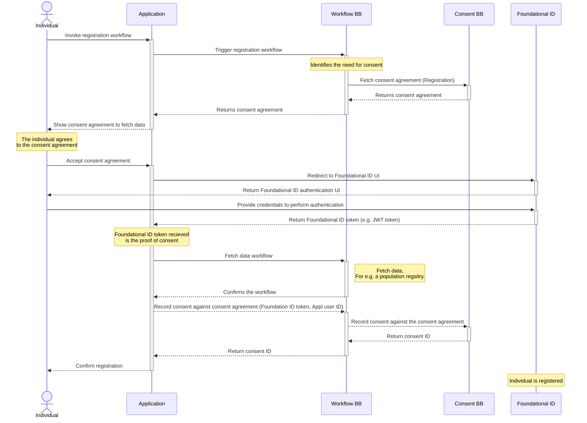
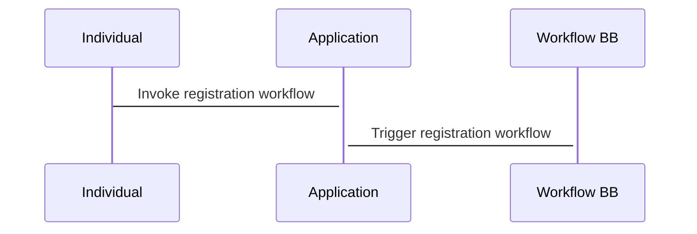
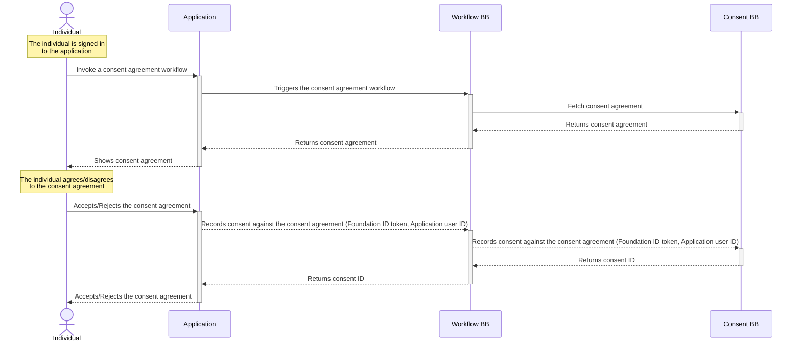
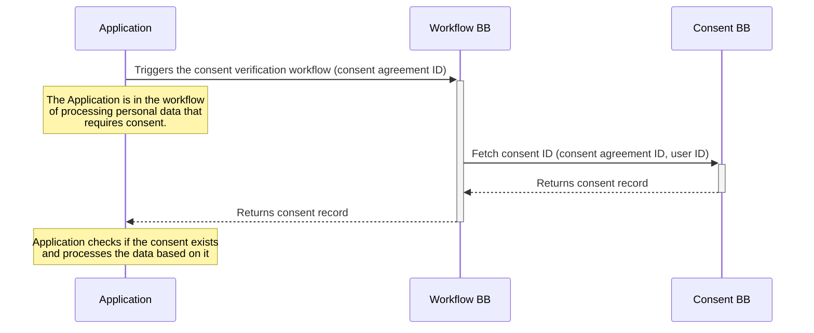

# 9 Internal Workflows

A workflow provides a detailed view of how this Building Block will interact with other Building Blocks to support common use cases. This section lists workflows that this Building Block must support. Other workflows may be implemented in addition to those listed.

## 9.1 Universal Consent Workflows

The workflow Building Block triggers the need for consent as part of the general business flow. The assumption is that a consenting process never exists outside of a purposeful comprehensive business process. Hence, it is important to define and control the data processing activities as part of a holistic data service. This section lays out key universal consent workflows that can be re-used within the various use cases (see [explanation in Workflow BB](https://govstack.gitbook.io/specification/building-blocks/workflow)). This enforces the best practices for organisations to adhere to personal data processing standards in any given context and jurisdiction. In these sequences, we have removed the Digital Registries Building Block in the sequence for simplicity. It will store all persistent consent data.

### 9.1.1 Consenting at initial registration (Pre-registration) using a centralised ID system

The first and somewhat unique use case is related to the need for consent when the Individual is not yet provisioned in the System processing the data. In such cases, the workflow requires the creation of a valid and trusted Foundational ID to be linked with the Consent Record. Below is shown how a pre-registration use of Consent's Workflow works.

#### Universal consent workflow pre-registration (uses centralised ID)






### 9.1.2 Consenting after the registration (Post-registration)

In more frequent situations, when the Individual is already provisioned in the System (post-registration), the consent workflow uses the existing ID tokens, and only the Consent Record is to be created. The following diagram shows how a generic post-registration use of consent works:

#### Universal consent flow post-registration (uses centralised ID)



<details>

<summary>Diagram source</summary>

```
title Universal consent flow post-registration (uses centralised ID)

actor Individual

note over Individual
    The individual is signed in
    to the application
end note


Individual->+Application: Invoke a consent agreement workflow
Application->+Workflow BB: Triggers the consent agreement workflow

Workflow BB->+Consent BB: Fetch consent agreement
Consent BB-->-Workflow BB: Returns consent agreement
Workflow BB-->-Application: Returns consent agreement
Application-->-Individual: Shows consent agreement

note over Individual
    The individual agrees/disagrees 
    to the consent agreement 
end note

Individual->+Application: Accepts/Rejects the consent agreement
Application-->+Workflow BB: Records consent against the consent agreement (Foundation ID token, Application user ID)
Workflow BB-->+Consent BB: Records consent against the consent agreement (Foundation ID token, Application user ID)
Consent BB-->-Workflow BB: Returns consent ID
Workflow BB-->-Application: Returns consent ID

Application-->-Individual: Accepts/Rejects the consent agreement
```

</details>

### 9.1.3 Consent Verification

The third universal workflow is about verifying if a valid Consent Record exists or not for a given data processing event within a business process. This may be the immediate continuation of a consenting workflow by the same System that acquired the Consent Record or it may be used by a separate business process by a different Application or at a different moment in time. The same verification workflow may be also used for auditing purposes. The following diagram shows how a generic verification for a valid consent works:

#### Universal consent verification


