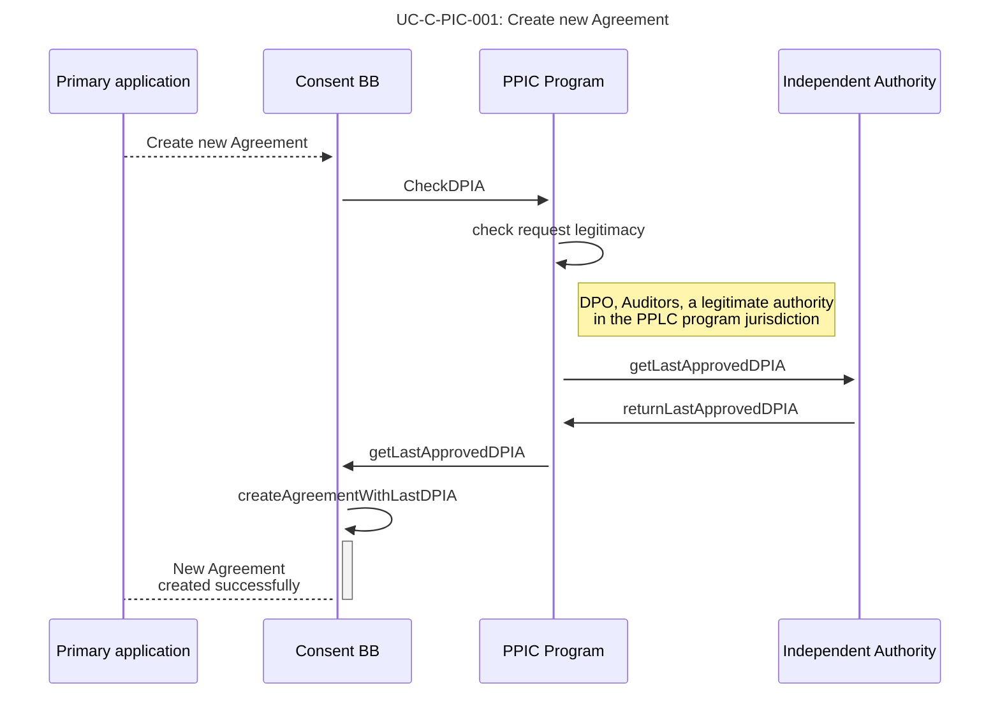
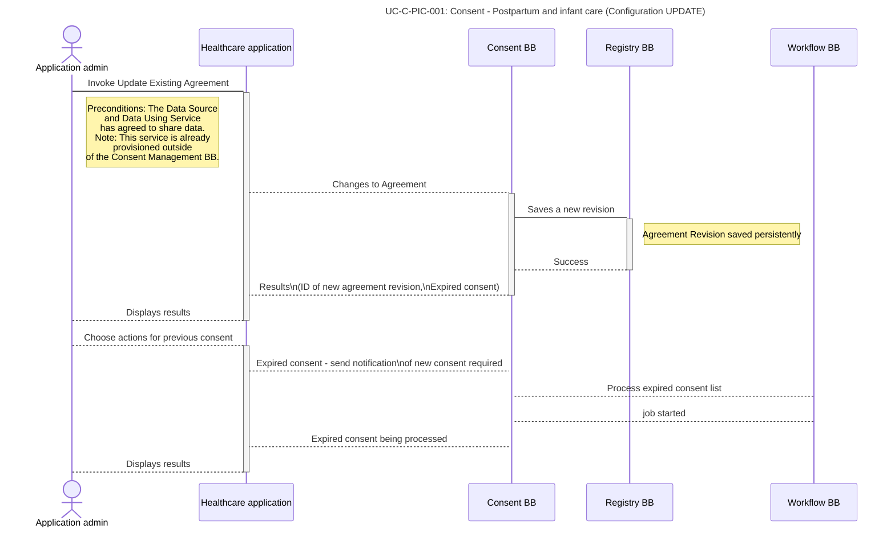

# UC-C-PIC-A: Organisation Administration Use Cases (CONFIGURATION)

## **Table of Contents**

[UC-C-PIC-A-001:\
Postpartum and infant care (Configuration CREATE)](uc-c-pic-a-organisation-administration-use-cases-configuration.md#uc-c-pic-a-001-postpartum-and-infant-care-configuration-create)

[UC-C-PIC-A-002:\
Postpartum and infant care (Configuration UPDATE)](uc-c-pic-a-organisation-administration-use-cases-configuration.md#uc-c-pic-a-002-postpartum-and-infant-care-configuration-update)

[UC-C-PIC-A-003:\
Postpartum and infant care (Configuration READ)](uc-c-pic-a-organisation-administration-use-cases-configuration.md#uc-c-pic-a-003-postpartum-and-infant-care-configuration-read)

[UC-C-PIC-A-004:\
Postpartum and infant care (Configuration DELETE)](uc-c-pic-a-organisation-administration-use-cases-configuration.md#uc-c-pic-a-004-postpartum-and-infant-care-configuration-delete)

[UC-C-PIC-A-005:\
Postpartum and infant care (Configuration NOTIFICATIONS)](uc-c-pic-a-organisation-administration-use-cases-configuration.md#uc-c-pic-a-005-postpartum-and-infant-care-configuration-notifications)

##

UC-C-PIC-A-001:\
Postpartum and infant care (Configuration CREATE)
-------------------------------------------------

| **ID**                                                                                                                         | UC-C-PIC-001                                                                                                                                                                                                                                                                                                                                                                                                                                                                                                                                                                                  |
| ------------------------------------------------------------------------------------------------------------------------------ | --------------------------------------------------------------------------------------------------------------------------------------------------------------------------------------------------------------------------------------------------------------------------------------------------------------------------------------------------------------------------------------------------------------------------------------------------------------------------------------------------------------------------------------------------------------------------------------------- |
| **Name**                                                                                                                       | Postpartum and infant care (Configuration CREATE)                                                                                                                                                                                                                                                                                                                                                                                                                                                                                                                                             |
| Description                                                                                                                    | The use case implements configuration of a consent agreement towards infant care use case scenarios. This results in a saved configuration to be issued to all mothers requiring infant care.                                                                                                                                                                                                                                                                                                                                                                                                 |
| 
Trigger (the event that triggers the use case)
                                                                       | <ol><li>The (healthcare) application admin/user wishes to configure the policies associated with the data usage.</li><li>Any change in the pre-condition that requires a re-configuration.</li></ol>                                                                                                                                                                                                                                                                                                                                                                                          |
| 
Preconditions (list of conditions that MUST be met in order for the use case to be successful)
                       | <ol><li>The (healthcare) application admin/user is logged into the system and has sufficient privileges to use the system</li><li>A healthcare policy exists, and is based on existing data laws for healthcare.</li><li>Assumption: consent is needed for pulling data from another system of the mother needing care.</li></ol>                                                                                                                                                                                                                                                             |
| Data inputs                                                                                                                    | <ol><li>Existing data policies relevant to the healthcare scenario</li><li>Any legal information, standards.</li></ol>                                                                                                                                                                                                                                                                                                                                                                                                                                                                        |
| 
Actors (a person, a company or organisation, a computer program, or a computer system - hardware, software, or both)
 | <ol><li>The (healthcare) application admin/user configures the data usage policy. (a person, IT admin)</li><li>The health-care provider application. (a computer system)</li><li>DPO, Auditors (A person, or an independent authority)</li></ol>
 

Optionally: a data intermediary or a data operator.
                                                                                                                                                                                                                                                                         |
| Normal Course (what happens if the event is triggered and the preconditions have been met)                                     | <ol><li>The healthcare application user is able to invoke the configuration workflow.</li><li>The healthcare user uses the existing policy relevant to registering for postpartum and infant care. This could be signed off by the organisation's DPO, for example.</li><li>The data required are:</li><li>

<ol><li>Usage purpose</li><li>Data policies and rules</li><li>Define what data is being collected</li></ol></li><li>The configuration is saved.</li><li>Once the DPO approves, the configuration is published towards the end-use case. I.e. registration system.</li></ol> |
| 
Alternative Course (links to other use cases in case there are different ways how to solve the same use case)
        | <ol><li>Data configuration error scenarios</li><li>DPO disapproves and the configuration is re-submitted for review and approval.</li></ol>                                                                                                                                                                                                                                                                                                                                                                                                                                                   |
| Data output                                                                                                                    | <ol><li>The consent configuration data</li></ol>                                                                                                                                                                                                                                                                                                                                                                                                                                                                                                                                              |
| Post-Conditions (the success criteria)                                                                                         | <ol><li>The data usage policy is saved in the system and is available for the month to consent to during the registration process.</li><li>The system is now configured and ready for collecting user consent during a registration workflow.</li></ol>                                                                                                                                                                                                                                                                                                                                       |
| 
Exceptions (error situations)
                                                                                        | (TBD - Should align with other error scenarios.)                                                                                                                                                                                                                                                                                                                                                                                                                                                                                                                                              |
| 
Related BBs (working groups related to that particular use case)
                                                     | <ol><li>Identity BB (Required for acquiring authentication token)</li><li>Workflow BB - workflow management</li><li>Information Mediator BB - providing interfaces</li><li>Security BB - supervision</li></ol>                                                                                                                                                                                                                                                                                                                                                                                |

### Sequence diagram

The following sequence diagrams details the role of the Independent Authority and the DPIA (Data Protection Impact Assessment) as the document upon which the postpartum infant care program can rely to parametrise the healthcare application for interacting with the Consent BB.

[Diagram Source](https://www.websequencediagrams.com/cgi-bin/cdraw?lz=dGl0bGUgVUMtQy1QSUMtMDAxOiBDcmVhdGUgbmV3IGFncmVtZW50CgpBY3RvciBIZWFsdGhjYXJlIGFwcGxpY2F0aW9uCgABFi0-Q29uc2VudCBNYW5hZwBEBSBCQjpjAFIOAFsGABYVLT5QUElDIFByb2dyYW06IGNoZWNrRFBJQQoADAwtPisAFBMgcmVxdWVzdCBsZWdpdGltYWN5Cm5vdGUgb3ZlciBJbmRlcGVuZGVudCBBdXRob3JpdHk6IERQTyxBdWRpdG9ycywgYQAzCXRlIGEAHgggaW4gdGhlIFBQTEMgcACBFQYganVyaXNkaWMAggoFAIEODwBVF2dldExhc3RBcHByb3ZlZACBUgUAgQIVLT4tAIF5DnJldHVybgAsEQCCBg4tAIJnFgAlGACCaRcrAC8XAIM-BkEAgzcIV2l0aExhc3QALxwtAIQnFjogTgCDfQwAUwdkIHN1Y2Nlc3NmdWxseQoKCg\&s=default)

UC-C-PIC-A-002:\
Postpartum and infant care (Configuration UPDATE)
-------------------------------------------------

| **ID**                                                                                                                                                           | UC-C-PIC-002                                                                                                                                                                                                                                                                                                                      |
| ---------------------------------------------------------------------------------------------------------------------------------------------------------------- | --------------------------------------------------------------------------------------------------------------------------------------------------------------------------------------------------------------------------------------------------------------------------------------------------------------------------------- |
| **Name**                                                                                                                                                         | Postpartum and infant care (Configuration UPDATE)                                                                                                                                                                                                                                                                                 |
| **Description**                                                                                                                                                  | Here, an organisation Administrator updates Consent Agreement based on the Data Policy requirements..                                                                                                                                                                                                                             |
| 
<strong>Trigger</strong> <strong>(the event that triggers the use case)</strong>
                                                                       | <ol><li>The (healthcare) application admin/user wishes to configure the policies associated with the data usage.</li><li>Any change in the pre-condition that requires a re-configuration.</li></ol>                                                                                                                              |
| 
<strong>Preconditions</strong> <strong>(list of conditions that MUST be met in order for the use case to be successful)</strong>
                       | <ol><li>The (healthcare) application admin/user is logged into the system and has sufficient privileges to use the system</li><li>A healthcare policy exists, and is based on existing data laws for healthcare.</li><li>Assumption: consent is needed for pulling data from another system of the mother needing care.</li></ol> |
| **Data inputs**                                                                                                                                                  | <ol><li>Existing data policies relevant to the healthcare scenario</li><li>Any legal information, standards.</li></ol>                                                                                                                                                                                                            |
| 
<strong>Actors</strong> <strong>(a person, a company or organisation, a computer program, or a computer system - hardware, software, or both)</strong>
 | <ol><li>The (healthcare) application admin/user configures the data usage policy. (a person, IT admin)</li><li>The health-care provider application. (a computer system)</li><li>DPO, Auditors (A person, or an independent authority)</li></ol>
 

Optionally: a data intermediary or a data operator.
             |
| **Normal Course (what happens if the event is triggered and the preconditions have been met)**                                                                   | TBD                                                                                                                                                                                                                                                                                                                               |
| 
<strong>Alternative Course</strong> <strong>(links to other use cases in case there are different ways how to solve the same use case)</strong>
        | <ol><li>Data configuration error scenarios</li><li>DPO disapproves and the configuration is re-submitted for review and approval.</li></ol>                                                                                                                                                                                       |
| **Data output**                                                                                                                                                  | <ol><li>Updated consent configuration data, Revision</li></ol>                                                                                                                                                                                                                                                                    |
| **Post-Conditions (the success criteria)**                                                                                                                       | <ol><li>The data usage policy is saved in the system and is available for the month to consent to during the registration process.</li><li>The system is now configured and ready for collecting user consent during a registration workflow.</li></ol>                                                                           |
| 
<strong>Exceptions</strong> <strong>(error situations)</strong>
                                                                                        | (TBD - Should align with other error scenarios.)                                                                                                                                                                                                                                                                                  |
| 
<strong>Related BBs</strong> <strong>(working groups related to that particular use case)</strong>
                                                     | <ol><li>Identity BB (Required for acquiring authentication token)</li><li>Workflow BB - workflow management</li><li>Registries BB - stores the data agreement data,</li><li>Information Mediator BB - providing interfaces</li><li>Security BB - supervision</li></ol>                                                            |

### Sequence diagram

## UC-C-PIC-A-003: Postpartum and infant care (Configuration READ)

## UC-C-PIC-A-004: Postpartum and infant care (Configuration DELETE)

## UC-C-PIC-A-005: Postpartum and infant care (Configuration NOTIFICATIONS)
