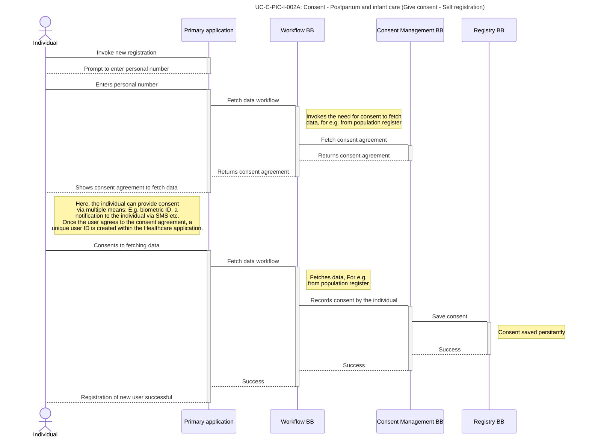
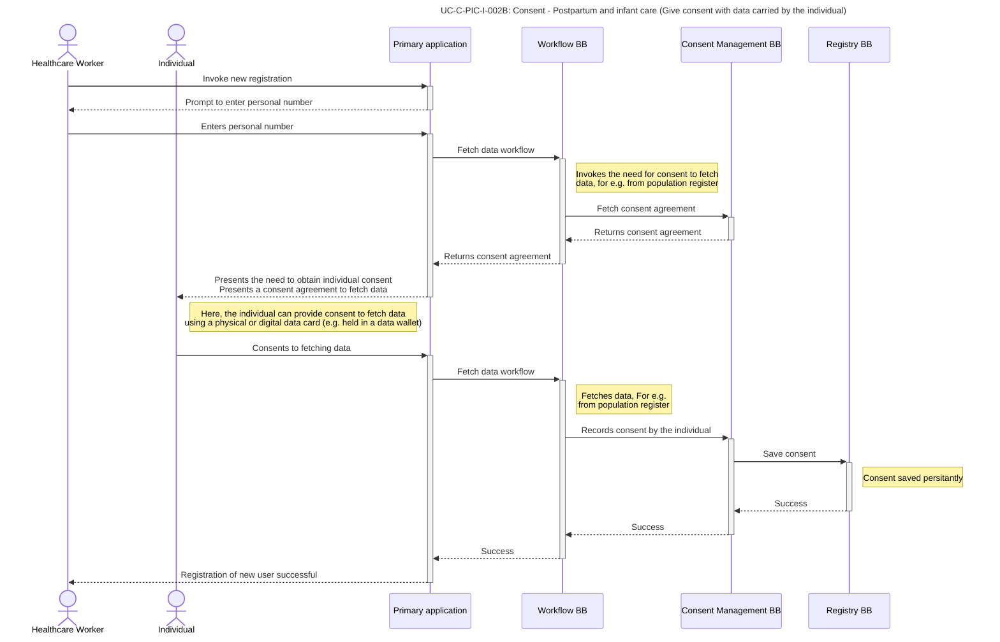
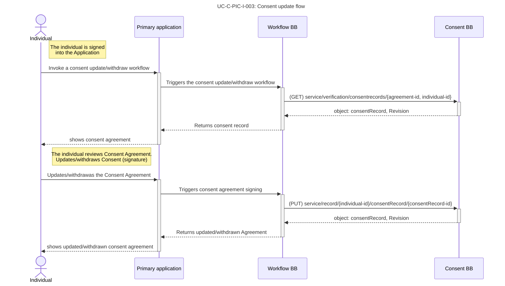

# UC-C-PIC-I: Individual use cases (SERVICES)

## **Table of Contents**

[UC-C-PIC-I-001: View Agreements](uc-c-pic-i-individual-use-cases-services.md#uc-c-pic-i-001-view-agreements)

[UC-C-PIC-I-002: Give consent to fetching data](uc-c-pic-i-individual-use-cases-services.md#uc-c-pic-i-002-give-consent-to-fetching-data)

[#option-a-self-registration-to-healthcare-application](uc-c-pic-i-individual-use-cases-services.md#option-a-self-registration-to-healthcare-application "mention")

[#option-b-assisted-registration-to-healthcare-application](uc-c-pic-i-individual-use-cases-services.md#option-b-assisted-registration-to-healthcare-application "mention")

[#option-c-individual-holding-the-data-for-registering-to-healthcare-application](uc-c-pic-i-individual-use-cases-services.md#option-c-individual-holding-the-data-for-registering-to-healthcare-application "mention")

[UC-C-PIC-I-003: Withdraw or update existing consent](uc-c-pic-i-individual-use-cases-services.md#uc-c-pic-i-003-withdraw-or-update-existing-consent)

[UC-C-PIC-I-004: Consent agreement change notification](uc-c-pic-i-individual-use-cases-services.md#uc-c-pic-i-004-consent-agreement-change-notification)

## UC-C-PIC-I-001: View Agreements

**Context: Postpartum and infant care**

| ID                                                                                                                             | UC-C-PIC-I-001                                                                                                                                                                                                                                                                                                  |
| ------------------------------------------------------------------------------------------------------------------------------ | --------------------------------------------------------------------------------------------------------------------------------------------------------------------------------------------------------------------------------------------------------------------------------------------------------------- |
| Name                                                                                                                           | View agreements - Postpartum and infant care                                                                                                                                                                                                                                                                    |
| Description                                                                                                                    | The use case implements the viewing and understanding consent agreements, data policies applied to personal data processing. This includes obtaining copies of the consent agreement.                                                                                                                           |
| 
Trigger (the event that triggers the use case)
                                                                       | <ol><li>The individual user wishes to view the agreements and policies associated with personal data usage</li></ol>                                                                                                                                                                                            |
| 
Preconditions (list of conditions that MUST be met in order for the use case to be successful)
                       | <ol><li>The individual user logged into the healthcare application and have sufficient privileges to use the system</li><li>The user has previously registered and signed the consent agreement</li><li>The healthcare application has pre-configured consent agreements for the use of personal data</li></ol> |
| Data inputs                                                                                                                    | <ol><li>Login credentials</li></ol>                                                                                                                                                                                                                                                                             |
| 
Actors (a person, a company or organisation, a computer program, or a computer system - hardware, software, or both)
 | <ol><li>Individual user</li><li>The health-care provider application. (a computer system)</li></ol>
 

Optionally: a data intermediary or a data operator.
                                                                                                                                        |
| Normal Course (what happens if the event is triggered and the preconditions have been met)                                     | <ol><li>The individual user invokes the view agreement workflow</li><li>Views all configured consent agreements</li><li>The user is able to download a copy of agreement</li></ol>                                                                                                                              |
| 
Alternative Course (links to other use cases in case there are different ways how to solve the same use case)
        | <ol><li>Get data failure scenarios</li><li>Download option fails</li></ol>
The individual is able to withdraw consent or update existing consents as the next step of viewing all consent agreements at one place.
                                                                                        |
| Data output                                                                                                                    | None                                                                                                                                                                                                                                                                                                            |
| Post-Conditions (the success criteria)                                                                                         | <ol><li>The individual is able to view consent agreements that are signed or to be signed.</li><li>The individual is also able to download the signed agreement</li></ol>                                                                                                                                       |
| 
Exceptions (error situations)
                                                                                        | <ul><li> </li></ul>                                                                                                                                                                                                                                                                                          |
| 
Related BBs (working groups related to that particular use case)
                                                     | <ol><li>Identity BB (Required for acquiring authentication token)</li><li>Registries BB - stores the data agreement data,</li><li>Information Mediator BB - providing interfaces</li><li>Security BB - supervision</li></ol>                                                                                    |

## UC-C-PIC-I-002: Give consent to fetching data

There are three alternatives possible for giving consent:

### Option A: Self-Registration to healthcare application

| ID                                                                                                                             | UC-C-PIC-I-002A                                                                                                                                                                                                                                                                                                                                                                                                                                                                              |
| ------------------------------------------------------------------------------------------------------------------------------ | -------------------------------------------------------------------------------------------------------------------------------------------------------------------------------------------------------------------------------------------------------------------------------------------------------------------------------------------------------------------------------------------------------------------------------------------------------------------------------------------- |
| Name                                                                                                                           | Consent - Postpartum and infant care (Give consent)                                                                                                                                                                                                                                                                                                                                                                                                                                          |
| Description                                                                                                                    | 
The use case allows an end-user to consent to fetch data from existing sources (possibly external to the application) or to manually fill in details during new mother registration.

 

In this option, the patient is doing a self-registration without any help of a healthcare assistant
                                                                                                                                                                             |
| 
Trigger (the event that triggers the use case)
                                                                       | <ol><li>During a registration process, the workflow BB assumes or identifies the need for consent (precondition).</li></ol>                                                                                                                                                                                                                                                                                                                                                                  |
| 
Preconditions (list of conditions that MUST be met in order for the use case to be successful)
                       | <ol><li>UC-C-PIC-001 has defined and published the configuration for the registration workflow.</li><li>The individual is already registered into an identity management system (for example a population registry) that holds the user information, as required for consent.</li><li>The user has the authority to consent as the owner or delegate to fetch the record.</li></ol>                                                                                                          |
| Data inputs                                                                                                                    | <ol><li>The unique identifier of the individual that can be verified/used across BBs. E.g. Social Security Number.</li><li>Service reference for which the consent is being sought</li><li>The consent agreement demonstrates the use of data for which the consent is being sought</li></ol>                                                                                                                                                                                                |
| 
Actors (a person, a company or organisation, a computer program, or a computer system - hardware, software, or both)
 | <ol><li>A consenting individual</li><li>The healthcare system application</li><li>The data source provides the registration data or credentials for a given identity data.</li></ol>                                                                                                                                                                                                                                                                                                         |
| Normal Course (what happens if the event is triggered and the preconditions have been met)                                     | <ol><li>The healthcare application understands the need for consent via the consent agreement definition.</li><li>The individual is presented with the consent agreement together with the data policy for registration, requesting the data to be fetched from an external source, e.g. population register.</li><li>The individual agrees (consents / opt-in) to fetch the data. A consent record is created.</li><li>The data is fetched from the external source successfully.</li></ol> |
| 
Alternative Course (links to other use cases in case there are different ways how to solve the same use case)
        | <ol><li>Individual cancels fetching the data.</li></ol>                                                                                                                                                                                                                                                                                                                                                                                                                                      |
| Data output                                                                                                                    | <ol><li>A consent record is created in the registry.</li></ol>                                                                                                                                                                                                                                                                                                                                                                                                                               |
| Post-Conditions (the success criteria)                                                                                         | <ol><li>The registration is completed successfully importing data from a data provider.</li><li>Consent Status is registered and can be queried (i.e. made available to the consent mediator)</li></ol>                                                                                                                                                                                                                                                                                      |
| 
Exceptions (error situations)
                                                                                        | 
 
                                                                                                                                                                                                                                                                                                                                                                                                                                                                                  |
| 
Related BBs (working groups related to that particular use case)
                                                     | <ol><li>Identity BB</li><li>Workflow BB - workflow management</li><li>Registries BB - Fetch the applicable data agreement</li><li>Information Mediator BB - providing interfaces</li><li>Security BB - supervision</li></ol>                                                                                                                                                                                                                                                                 |

### Sequence diagram

### Option B: Assisted registration to healthcare application

| ID                                                                                                                             | UC-C-PIC-I-002B                                                                                                                                                                                                                                                                                                                                                                                                                                                                                                                                              |
| ------------------------------------------------------------------------------------------------------------------------------ | ------------------------------------------------------------------------------------------------------------------------------------------------------------------------------------------------------------------------------------------------------------------------------------------------------------------------------------------------------------------------------------------------------------------------------------------------------------------------------------------------------------------------------------------------------------ |
| Name                                                                                                                           | Consent - Postpartum and infant care (Give consent)                                                                                                                                                                                                                                                                                                                                                                                                                                                                                                          |
| Description                                                                                                                    | 
The use case implements end-user to consent to fetch data from existing sources or to manually fill in details during new mother registration.

 

In this option, the patient is assisted by a healthcare assistant
                                                                                                                                                                                                                                                                                                                     |
| 
Trigger (the event that triggers the use case)
                                                                       | Same as UC-C-PIC-I-002A                                                                                                                                                                                                                                                                                                                                                                                                                                                                                                                                      |
| 
Preconditions (list of conditions that MUST be met in order for the use case to be successful)
                       | Same as UC-C-PIC-I-002A                                                                                                                                                                                                                                                                                                                                                                                                                                                                                                                                      |
| Data inputs                                                                                                                    | <ol><li>The primary identity is key to the individual. E.g. Social Security Number by the healthcare assistant</li></ol>
Rest same as UC-C-PIC-I-002A
                                                                                                                                                                                                                                                                                                                                                                                                  |
| 
Actors (a person, a company or organisation, a computer program, or a computer system - hardware, software, or both)
 | <ol><li>A healthcare assistant assisting in the registration process</li></ol>
Rest same as UC-C-PIC-I-002A
                                                                                                                                                                                                                                                                                                                                                                                                                                            |
| 
Normal Course (what happens if the event is triggered and the preconditions have been met)

 
                   | <ol><li>The healthcare application understands the need for consent via the consent agreement definition. The healthcare assistant gets notified of the need for consent.</li><li>The individual is presented with the consent agreement together with the data policy for registration, requesting the data to be fetched from an external source, e.g. population register.</li><li>The individual agrees (consents / opt-in) to fetch the data. A consent record is created.</li><li>The data is fetched from the external source successfully.</li></ol> |
| 
Alternative Course (links to other use cases in case there are different ways how to solve the same use case)
        | <ol><li>Individual cancels or opts out of fetching the data</li></ol>                                                                                                                                                                                                                                                                                                                                                                                                                                                                                        |
| Data output                                                                                                                    | Same as UC-C-PIC-I-002A                                                                                                                                                                                                                                                                                                                                                                                                                                                                                                                                      |
| Post-Conditions (the success criteria)                                                                                         | <ol><li>The registration is completed successfully importing data from a data provider.</li></ol>                                                                                                                                                                                                                                                                                                                                                                                                                                                            |
| 
Exceptions (error situations)
                                                                                        | 
 
                                                                                                                                                                                                                                                                                                                                                                                                                                                                                                                                                  |
| 
Related BBs (working groups related to that particular use case)
                                                     | Same as UC-C-PIC-I-002A                                                                                                                                                                                                                                                                                                                                                                                                                                                                                                                                      |

### Sequence diagram

### Option C: Individual “holding” the data for registering to healthcare application

| ID                                                                                                                             | UC-C-PIC-I-002C                                                                                                                                                                                                                                                                                                                                                                                                                                                                                                                                                              |
| ------------------------------------------------------------------------------------------------------------------------------ | ---------------------------------------------------------------------------------------------------------------------------------------------------------------------------------------------------------------------------------------------------------------------------------------------------------------------------------------------------------------------------------------------------------------------------------------------------------------------------------------------------------------------------------------------------------------------------- |
| Name                                                                                                                           | Consent - Postpartum and infant care (Give consent)                                                                                                                                                                                                                                                                                                                                                                                                                                                                                                                          |
| Description                                                                                                                    | 
The use case implements end-user to consent to fetch data from existing sources or to manually fill in details during new mother registration.

 

In this option, the patient is using a physical or digital document or data card as a data source that is verifiable
                                                                                                                                                                                                                                                                                  |
| 
Trigger (the event that triggers the use case)
                                                                       | <ol><li>During a registration process, the workflow BB identifies the need for consent.</li></ol>                                                                                                                                                                                                                                                                                                                                                                                                                                                                            |
| 
Preconditions (list of conditions that MUST be met in order for the use case to be successful)
                       | Same as UC-C-PIC-I-002A                                                                                                                                                                                                                                                                                                                                                                                                                                                                                                                                                      |
| Data inputs                                                                                                                    | Same as UC-C-PIC-I-002A                                                                                                                                                                                                                                                                                                                                                                                                                                                                                                                                                      |
| 
Actors (a person, a company or organisation, a computer program, or a computer system - hardware, software, or both)
 | 
Same as UC-C-PIC-I-002A or UC-C-PIC-I-002B

 
                                                                                                                                                                                                                                                                                                                                                                                                                                                                                                                 |
| Normal Course (what happens if the event is triggered and the preconditions have been met)                                     | <ol><li>The healthcare application understands the need for consent via the consent agreement definition.</li><li>The individual is presented with the consent agreement together with the data policy for registration, requesting the data to be fetched from a verifiable document (physical or digital)</li><li>The individual uses the verifiable document, explicitly consenting to the use of data. A consent record is created.</li><li>The data is fetched from the data card (may use an external system as configured in the physical or digital card).</li></ol> |
| 
Alternative Course (links to other use cases in case there are different ways how to solve the same use case)
        | <ol><li>Individual cancels fetching the data.</li></ol>                                                                                                                                                                                                                                                                                                                                                                                                                                                                                                                      |
| Data output                                                                                                                    | <ol><li>A consent record is created in the registry.</li></ol>                                                                                                                                                                                                                                                                                                                                                                                                                                                                                                               |
| Post-Conditions (the success criteria)                                                                                         | <ol><li>The registration is completed successfully importing data from a data provider.</li></ol>                                                                                                                                                                                                                                                                                                                                                                                                                                                                            |
| 
Exceptions (error situations)
                                                                                        | 
 
                                                                                                                                                                                                                                                                                                                                                                                                                                                                                                                                                                  |
| 
Related BBs (working groups related to that particular use case)
                                                     | Same as UC-C-PIC-I-002A                                                                                                                                                                                                                                                                                                                                                                                                                                                                                                                                                      |

### Sequence diagram

Note: Here, the sequence shows the case for assisted registration flow. The same applies also for self-registration.

## UC-C-PIC-I-003: Withdraw or update existing consent

| ID                                                                                                                             | UC-C-PIC-I-003                                                                                                                                                                                                                                                                                                      |
| ------------------------------------------------------------------------------------------------------------------------------ | ------------------------------------------------------------------------------------------------------------------------------------------------------------------------------------------------------------------------------------------------------------------------------------------------------------------- |
| Name                                                                                                                           | Withdraw or update existing consent - Postpartum and infant care                                                                                                                                                                                                                                                    |
| Description                                                                                                                    | The use case implement the withdrawal or updating of existing signed consent agreements.                                                                                                                                                                                                                            |
| 
Trigger (the event that triggers the use case)
                                                                       | <ol><li>The individual user wishes to withdraw or update the existing consent agreement with regard to the use of personal data.</li></ol>                                                                                                                                                                          |
| 
Preconditions (list of conditions that MUST be met in order for the use case to be successful)
                       | <ol><li>The individual user logged into the healthcare application and have sufficient privileges to use the system</li><li>The user has previously registered and signed the consent agreement(s).</li><li>The healthcare application has pre-configured consent agreements for the use of personal data</li></ol> |
| Data inputs                                                                                                                    | <ol><li>Login credentials</li></ol>                                                                                                                                                                                                                                                                                 |
| 
Actors (a person, a company or organisation, a computer program, or a computer system - hardware, software, or both)
 | <ol><li>Individual user</li><li>The health-care provider application. (a computer system)</li></ol>
 

Optionally: a data intermediary or a data operator.
                                                                                                                                            |
| Normal Course (what happens if the event is triggered and the preconditions have been met)                                     | <ol><li>The individual user invokes the view agreement use case (UC-C-PIC-I-001) and views all existing consent agreements</li><li>The individual user chooses the particular consent which needs to withdraw consent or update an earlier consent.</li><li>The individual user confirms the action</li></ol>       |
| 
Alternative Course (links to other use cases in case there are different ways how to solve the same use case)
        | <ol><li>Withdraw or update consent failure scenarios</li><li>Connection error scenarios</li></ol>                                                                                                                                                                                                                   |
| Data output                                                                                                                    | NA                                                                                                                                                                                                                                                                                                                  |
| Post-Conditions (the success criteria)                                                                                         | <ol><li>The individual is able to view consent agreements that are signed or to be signed.</li><li>The individual is able to withdraw consent or update existing consents.</li></ol>                                                                                                                                |
| 
Exceptions (error situations)
                                                                                        | <ul><li> </li></ul>                                                                                                                                                                                                                                                                                              |
| 
Related BBs (working groups related to that particular use case)
                                                     | <ol><li>Identity BB (Required for acquiring authentication token)</li><li>Registries BB - stores the data agreement data,</li><li>Information Mediator BB - providing interfaces</li><li>Security BB - supervision</li></ol>                                                                                        |

### Sequence diagram

## UC-C-PIC-I-004: Consent agreement change notification

| ID                                                                                                                             | UC-C-PIC-I-004                                                                                                                                                                                                                                                                                                      |
| ------------------------------------------------------------------------------------------------------------------------------ | ------------------------------------------------------------------------------------------------------------------------------------------------------------------------------------------------------------------------------------------------------------------------------------------------------------------- |
| Name                                                                                                                           | Consent agreement change notification- Postpartum and infant care                                                                                                                                                                                                                                                   |
| Description                                                                                                                    | The use case implement the Consent agreement change notification for existing consent agreements                                                                                                                                                                                                                    |
| 
Trigger (the event that triggers the use case)
                                                                       | <ol><li>The individual user wishes to withdraw or update the existing consent agreement with regard to the use of personal data.</li></ol>                                                                                                                                                                          |
| 
Preconditions (list of conditions that MUST be met in order for the use case to be successful)
                       | <ol><li>The individual user logged into the healthcare application and have sufficient privileges to use the system</li><li>The user has previously registered and signed the consent agreement(s).</li><li>The healthcare application has pre-configured consent agreements for the use of personal data</li></ol> |
| Data inputs                                                                                                                    | <ol><li>Login credentials</li></ol>                                                                                                                                                                                                                                                                                 |
| 
Actors (a person, a company or organisation, a computer program, or a computer system - hardware, software, or both)
 | <ol><li>Individual user</li><li>The health-care provider application. (a computer system)</li></ol>
 

Optionally: a data intermediary or a data operator.
                                                                                                                                            |
| Normal Course (what happens if the event is triggered and the preconditions have been met)                                     | <ol><li>The individual user invokes the view agreement use case (UC-C-PIC-I-001) and views all existing consent agreements</li><li>The individual user chooses the particular consent which needs to withdraw consent or update an earlier consent.</li><li>The individual user confirms the action</li></ol>       |
| 
Alternative Course (links to other use cases in case there are different ways how to solve the same use case)
        | <ol><li>Withdraw or update consent failure scenarios</li><li>Connection error scenarios</li></ol>                                                                                                                                                                                                                   |
| Data output                                                                                                                    | NA                                                                                                                                                                                                                                                                                                                  |
| Post-Conditions (the success criteria)                                                                                         | <ol><li>The individual is able to view consent agreements that are signed or to be signed.</li><li>The individual is able to withdraw consent or update existing consents.</li></ol>                                                                                                                                |
| 
Exceptions (error situations)
                                                                                        | 
 
                                                                                                                                                                                                                                                                                                         |
| 
Related BBs (working groups related to that particular use case)
                                                     | <ol><li>Identity BB (Required for acquiring authentication token)</li><li>Registries BB - stores the data agreement data,</li><li>Information Mediator BB - providing interfaces</li><li>Security BB - supervision</li></ol>                                                                                        |

### Sequence diagram

Diagram Source
